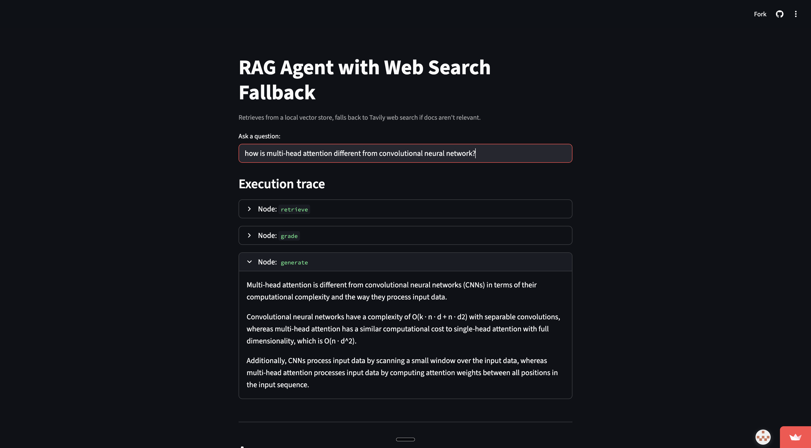
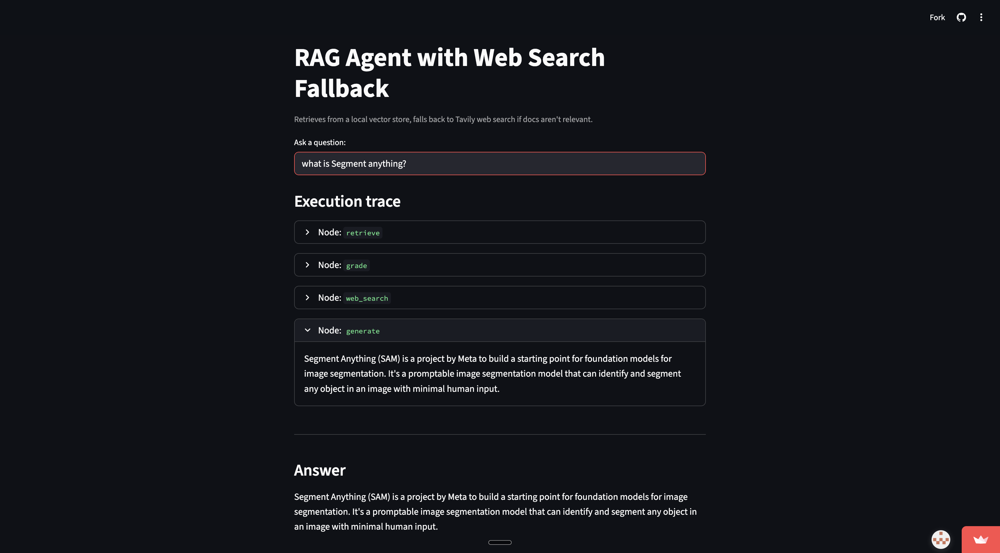

# RAG Agent with Web Search Fallback

**Live demo:** [rag-agent-leddrvanwpwyy2nv6efqxd.streamlit.app](https://rag-agent-leddrvanwpwyy2nv6efqxd.streamlit.app/)

A LangGraph-based retrieval-augmented generation agent that retrieves from a local vector store and falls back to web search when the corpus doesn't cover the question.

Built as a portfolio project demonstrating conditional graph routing, graded retrieval, and production-relevant design decisions.

---

## Screenshots

**RAG path** — query answered directly from the vector store:


**Web search fallback** — query routed to Tavily when the corpus isn't relevant:


---

## Tech stack

| Layer | Technology |
|---|---|
| **Orchestration** | LangGraph `StateGraph` with conditional routing |
| **Observability** | LangSmith |
| **LLM — grading** | Groq `llama-3.3-70b-versatile` (reliable tool calling for structured output) |
| **LLM — generation** | Groq `llama-3.1-8b-instant` (fast, low latency) |
| **Embeddings** | HuggingFace `all-MiniLM-L6-v2` via sentence-transformers (local, no API cost) |
| **Vector store** | Chroma (persisted locally at `./chroma_db`, retrieves `k=4`) |
| **Document loading** | LangChain `PyPDFLoader` |
| **Chunking** | `RecursiveCharacterTextSplitter` (chunk size 1000, overlap 200) |
| **Web search fallback** | Tavily `TavilySearch` (max 3 results) |
| **Structured output** | Pydantic v2 via `with_structured_output()` |
| **State** | `TypedDict` (`AgentState`) — LangGraph state with `question`, `documents`, `generation`, `web_search_needed` |
| **UI** | Streamlit with per-node execution trace |

---

## Architecture

```
                    ┌─────────────┐
                    │   START     │
                    └──────┬──────┘
                           ▼
                    ┌─────────────┐
                    │  retrieve   │  ← pull k=4 chunks from Chroma
                    └──────┬──────┘
                           ▼
                    ┌─────────────┐
                    │   grade     │  ← are docs relevant to the question?
                    └──────┬──────┘
                           ▼
                      ◇ relevant? ◇
                       ╱         ╲
                    yes           no
                     ▼             ▼
              ┌──────────┐   ┌──────────┐
              │ generate │   │  search  │  ← Tavily web search
              └────┬─────┘   └────┬─────┘
                   │              ▼
                   │        ┌──────────┐
                   │        │ generate │
                   │        └────┬─────┘
                   ▼             ▼
                    ┌─────────────┐
                    │     END     │
                    └─────────────┘
```

The graph is compiled from `graph.py` and the ASCII diagram above is generated live with `python graph.py`.

---

## Setup

**Requirements:** Python 3.10+, a [Groq API key](https://console.groq.com) (free), a [Tavily API key](https://app.tavily.com) (free).

```bash
# 1. Clone and enter the project
cd rag-agent

# 2. Create and activate virtual environment
python -m venv .venv
source .venv/bin/activate      # macOS/Linux
# .venv\Scripts\activate       # Windows

# 3. Install dependencies
pip install -r requirements.txt

# 4. Set up environment variables
cp .env.example .env
# Edit .env and fill in GROQ_API_KEY and TAVILY_API_KEY

# 5. Build the vector store (one-time)
python ingest.py

# 6. Test nodes in isolation
python test_nodes.py

# 7. Run the Streamlit UI
streamlit run app.py
```

### Sample document

`ingest.py` defaults to indexing [Attention Is All You Need](https://arxiv.org/abs/1706.03762) (Vaswani et al., 2017), downloaded to `docs/attention_is_all_you_need.pdf`. To index your own PDF:

```bash
python ingest.py path/to/your_document.pdf
```

---

## File structure

```
rag-agent/
├── .env.example        # Key placeholders — copy to .env
├── .gitignore
├── requirements.txt
├── state.py            # AgentState TypedDict — the graph's data contract
├── nodes.py            # retrieve, grade, web_search, generate, decide_to_search
├── graph.py            # Wires nodes into a compiled LangGraph StateGraph
├── ingest.py           # One-time: load PDF → split → embed → store in Chroma
├── test_nodes.py       # Tests each node independently before running the graph
├── app.py              # Streamlit UI with per-node execution trace
└── docs/
    └── attention_is_all_you_need.pdf
```

---

## Design decisions

### Why graded RAG instead of plain RAG?

Plain RAG always retrieves and always generates — it just hopes the retrieved documents are relevant. When they're not, the model either hallucinates or hedges with "I don't know," with no way to do better.

The grader node adds an explicit relevance check after retrieval. If the corpus doesn't cover the question, the agent routes to web search rather than generating a bad answer. This is a real engineering decision: you're trading one extra LLM call per query for a much more reliable system on out-of-distribution questions.

The grader uses `with_structured_output(GradeDocuments)` — a Pydantic-backed structured output that forces the model to return a typed object rather than free text. This is more reliable than parsing "yes"/"no" out of a string, and it's the current LangChain idiom for any decision node.

### Why LangGraph instead of a LangChain AgentExecutor?

An `AgentExecutor` lets the LLM decide at runtime which tools to call and in what order. That's powerful for open-ended tasks but it means the control flow is non-deterministic — hard to test, hard to debug, hard to reason about.

LangGraph makes control flow explicit. Every node, every edge, and every conditional branch is declared in code. The grader runs every time, unconditionally. The routing decision is a pure Python function, not an LLM output. You can inspect state at every step, replay any execution, and add new nodes without breaking existing ones. For a system with a specific, known control flow like graded RAG, this is strictly better than an agent loop.

### Why Chroma for the vector store?

Chroma runs locally with zero infrastructure — no Docker, no cloud account, no config. The index lives on disk at `./chroma_db/` and persists between runs. For a demo or portfolio project this is the right call. In production the choice depends on scale and existing stack: pgvector if you're already on Postgres, Pinecone or Weaviate for dedicated vector search at scale.

### Why local embeddings (sentence-transformers)?

`all-MiniLM-L6-v2` runs on CPU, costs nothing per query, and has no network dependency in the retrieval path. This matters: with cloud embeddings, every query hits an external API twice (once to embed the query, once during ingest per chunk). Local embeddings remove that latency and cost. The tradeoff is a slightly weaker embedding model — in practice, MiniLM is strong enough for most document retrieval tasks and the difference rarely shows up before you've tuned chunking and retrieval parameters anyway.

### Why two models for grading vs. generation?

`with_structured_output()` uses tool calling under the hood, which smaller models handle unreliably. The grader uses `llama-3.3-70b-versatile` because it needs to return a valid typed object every time — a malformed response breaks the routing logic. Generation uses `llama-3.1-8b-instant` because it just needs to follow a prompt, which small models do fine. Using the larger model only where reliability matters keeps latency and token costs down.

---

## What I'd do next

**Re-ranking** — after retrieving k=4 chunks, run a cross-encoder (e.g. `sentence-transformers/cross-encoder/ms-marco-MiniLM-L-6-v2`) to re-score and re-order them before passing to the generator. Cross-encoders compare query and document jointly rather than independently, which significantly improves the quality of what the generator sees.

**Query rewriting** — add a node before retrieval that rewrites the user's question into a retrieval-optimized form. Conversational questions ("what did you say about attention earlier?") retrieve poorly; a rewritten form ("attention mechanism transformer self-attention") retrieves well.

**Hallucination check** — add a grounding node after generation that checks whether the answer is supported by the retrieved documents. If not, loop back to web search. This closes the loop on cases where the generator produces something plausible but not grounded.

**Retrieval evals** — use RAGAS or LangSmith evals to measure retrieval precision and answer faithfulness. Without evals, tuning chunk size and k is guesswork.

**Persistent memory** — LangGraph's `MemorySaver` checkpointer enables multi-turn conversations where the agent remembers prior exchanges. One import and one parameter change to `compile()`.
